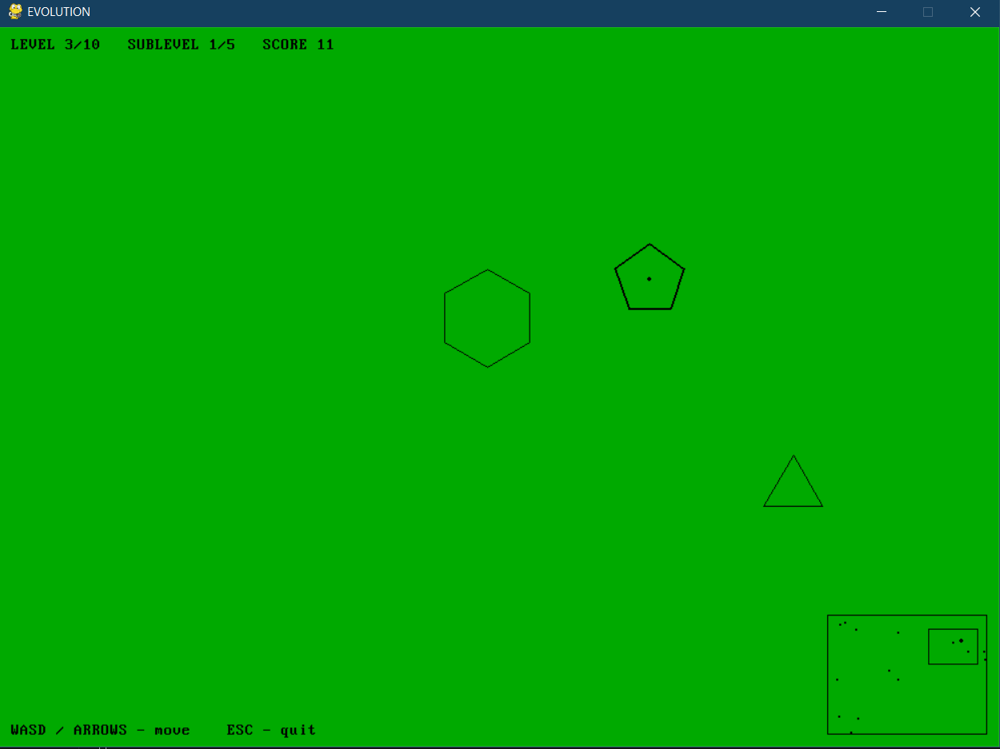

# EVOLUTION

> Ретро-игра в духе MS-DOS начала 90-х: тонкие контурные фигуры на одноцветном фоне, медленное движение с инерцией, поедание меньших и рост от уровня к уровню.


---

## Содержание

- [Об игре](#об-игре)
- [Скриншот](#скриншот)
- [Установка](#установка)
- [Запуск](#запуск)
- [Управление](#управление)
- [Правила](#правила)
- [Уровни и фигуры](#уровни-и-фигуры)
- [Шрифты в стиле MS-DOS](#шрифты-в-стиле-ms-dos)
- [Технические детали](#технические-детали)
- [Структура проекта](#структура-проекта)
- [Лицензия](#лицензия)

---

## Об игре

**EVOLUTION** — восстановленная по памяти копия неизвестной игры из 1990х, концепция которой очень схожа со первой главой Spore.

Вы управляете одной из фигур. Ваша цель — поедать тех, кто меньше вас, и не попасться тем, кто больше. С каждым съеденным соперником фигура растёт, а на пятом подуровне переходит на новый уровень, меняя форму и перекрашивая мир.

**Ключевые особенности:**

- Палитра **16 цветов EGA/VGA** — строго из MS-DOS.
- Фигуры нарисованы **только тонким контуром** (1 px у NPC, 2 px у игрока), без заливки.
- Низкий FPS (**30 кадров/с**) и субпиксельные шаги физики, чтобы движение ощущалось «как в 1992-м».
- Камера с **мёртвой зоной** и **шаговым скроллом по 8 px** — как тайловый скролл старых игр.
- Большой мир **3200 × 2400** — почти в 11 раз больше экрана.
- Простой, но живой ИИ: NPC преследуют меньших, убегают от больших, едят друг друга.
- **10 уровней** фона и **10 форм** фигур.

---

## Скриншот


---

## Установка

Требуется **Python 3.8+** и **pygame 2.x**.

### 1. Клонировать репозиторий

```bash
git clone https://github.com/Elinvar-labs/evolution2000
cd evolution
```

### 2. Создать виртуальное окружение (uv)

```bash
uv sync
```

## Запуск

```bash
uv run main.py
```

---

## Управление

| Клавиша                | Действие                       |
| ---------------------- | ------------------------------ |
| `←` `→` `↑` `↓`        | Движение                       |
| `A` `D` `W` `S`        | Альтернативное движение        |
| `Enter` / `Space`      | Начать заново после игры       |
| `Esc`                  | Выход                          |

Игрок разгоняется медленно и после отпускания клавиш ещё какое-то время скользит — это часть игрового дизайна.

---

## Правила

1. **Кто больше — тот и ест.** Фигура съедает другую, если её размер превышает размер соперника более чем на 15%.
2. **Равные отскакивают.** Никто не может съесть фигуру сопоставимого размера.
3. **Рост.** За каждого съеденного NPC даётся **+1 подуровень**. На подуровне 5 → переход на новый уровень (смена формы и цвета фона, размер сильно растёт).
4. **Победа.** Достичь 10-го уровня и 5-го подуровня — финальная форма (восьмиконечная звезда).
5. **Поражение.** Любая фигура крупнее вас съедает вас → **GAME OVER**.
6. **Стены мира.** Отскок с потерей 40% скорости — никто не «залипает» в углах.

Мир бесконечен в плане спавна — NPC появляются постоянно, при этом игра следит, чтобы рядом всегда было **минимум 4 меньших** и **минимум 3 больших** фигуры, чем вы. Так игра остаётся проходимой на любом этапе.

---

## Уровни и фигуры

| Уровень | Цвет фона   | Цвет контура | Форма фигуры       | Радиус (подур. 1 → 5) |
| :-----: | ----------- | ------------ | ------------------ | :-------------------: |
|    1    | Синий       | Белый        | Треугольник        | 10 → 42 px            |
|    2    | Красный     | Жёлтый       | Квадрат            | 23 → 55 px            |
|    3    | Зелёный     | Чёрный       | Пятиугольник       | 36 → 68 px            |
|    4    | Тёмно-серый | Белый        | Шестиугольник      | 49 → 81 px            |
|    5    | Белый       | Чёрный       | Семиугольник       | 62 → 94 px            |
|    6    | Чёрный      | Белый        | Восьмиугольник     | 75 → 107 px           |
|    7    | Циан        | Красный      | ~Круг (14-угольник)| 88 → 120 px           |
|    8    | Маджента    | Жёлтый       | 5-лучевая звезда   | 101 → 133 px          |
|    9    | Жёлтый      | Синий        | 6-лучевая звезда   | 114 → 146 px          |
|   10    | Светло-серый| Маджента     | 8-лучевая звезда   | 127 → 159 px          |

Максимальная фигура — **диаметр ~318 px**, что составляет примерно **треть высоты экрана**.

---

## Шрифты в стиле MS-DOS

По умолчанию игра использует системный шрифт `PerfectDOSVGA437.ttf`, но вы можете положить в корень проекта любой из пиксельных TTF — игра автоматически его подхватит:

- `dos.ttf`
- `PerfectDOSVGA437.ttf`
- `More Perfect DOS VGA.ttf`
- `PressStart2P-Regular.ttf`
- `Fixedsys Excelsior 3.01.ttf`

---

## Технические детали

### Палитра

Все цвета взяты из стандартной 16-цветной палитры EGA/VGA (подмножество режима VGA 256 цветов MS-DOS):

```python
BLACK         = (0,   0,   0)
BLUE          = (0,   0,   170)
GREEN         = (0,   170, 0)
CYAN          = (0,   170, 170)
RED           = (170, 0,   0)
MAGENTA       = (170, 0,   170)
BROWN         = (170, 85,  0)
LIGHT_GRAY    = (170, 170, 170)
DARK_GRAY     = (85,  85,  85)
LIGHT_BLUE    = (85,  85,  255)
LIGHT_GREEN   = (85,  255, 85)
LIGHT_CYAN    = (85,  255, 255)
LIGHT_RED     = (255, 85,  85)
LIGHT_MAGENTA = (255, 85,  255)
YELLOW        = (255, 255, 85)
WHITE         = (255, 255, 255)
```

### Формула размера

```
size(level, sublevel) = 10 + (level - 1) * 13 + (sublevel - 1) * 8
```

### Физика

- Инерция: `v *= 0.95` каждый кадр при 30 FPS.
- Разгон игрока: `±0.5 px/кадр²`.
- Отскок от стен: `v *= -0.6`.
- Съедание: порог `size_a > size_b * 1.15`.

### Камера

- Мёртвая зона: 35–65% экрана.
- Шаг скролла: **8 px за кадр**, с точным доведением до цели.
- Все координаты камеры — целые числа (пиксельная синхронизация).
- Все позиции рендера проходят через `int()`.

---

## Структура проекта

```
evolution/
├── evolution.py         # вся игра в одном файле (~430 строк)
├── requirements.txt     # pygame
├── README.md            # этот файл
├── LICENSE              # MIT
└── (опционально) dos.ttf, screenshot.png
```

Игра специально написана **одним файлом** без зависимостей, кроме pygame — так её проще читать, модифицировать и запускать.

---

## Идеи для форка

- 📱 Поддержка геймпада.
- 🔊 8-битные звуки PC Speaker через `pygame.mixer` (бипер).
- 💾 Таблица рекордов в текстовом файле.
- 🌍 Генерация миров из фиксированного сида.
- 👥 Второй игрок на одной клавиатуре (стрелки + WASD).
- 🎨 Режим VGA 256 цветов с полной палитрой.

---

## Лицензия

Распространяется под лицензией **MIT**. См. файл `LICENSE`.

Игра вдохновлена аркадами начала 90-х и не содержит чужого кода или ассетов.

---

<sub>Сделано с ностальгией по эпохе, когда треть экрана занимал один спрайт, а треть дисковода — одна игра.</sub>
